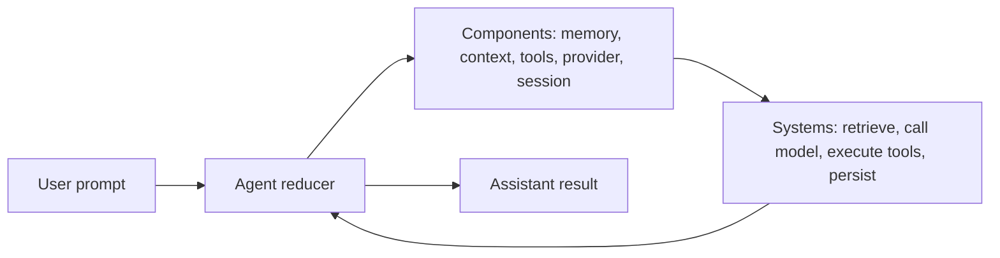
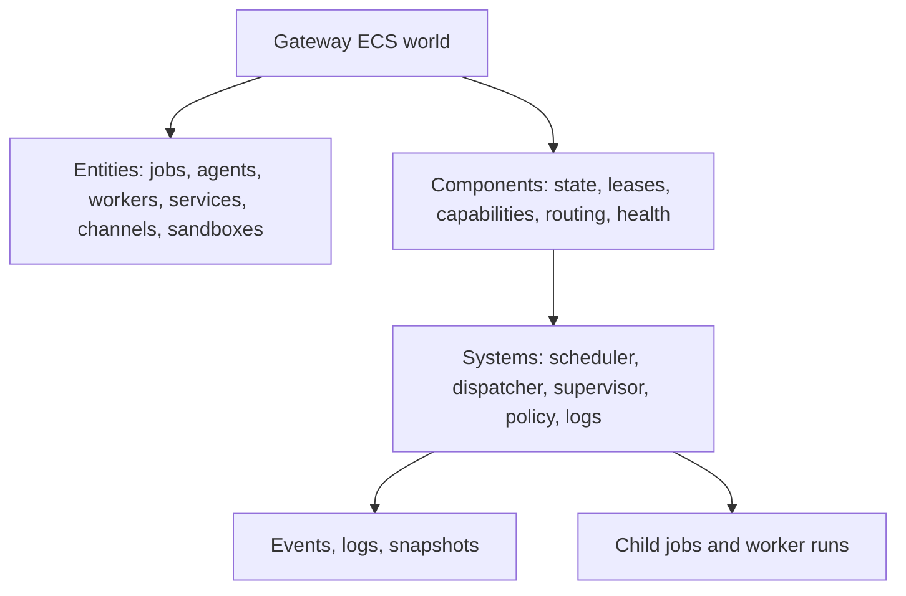
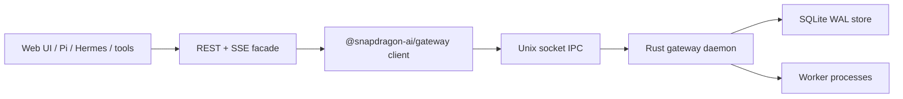
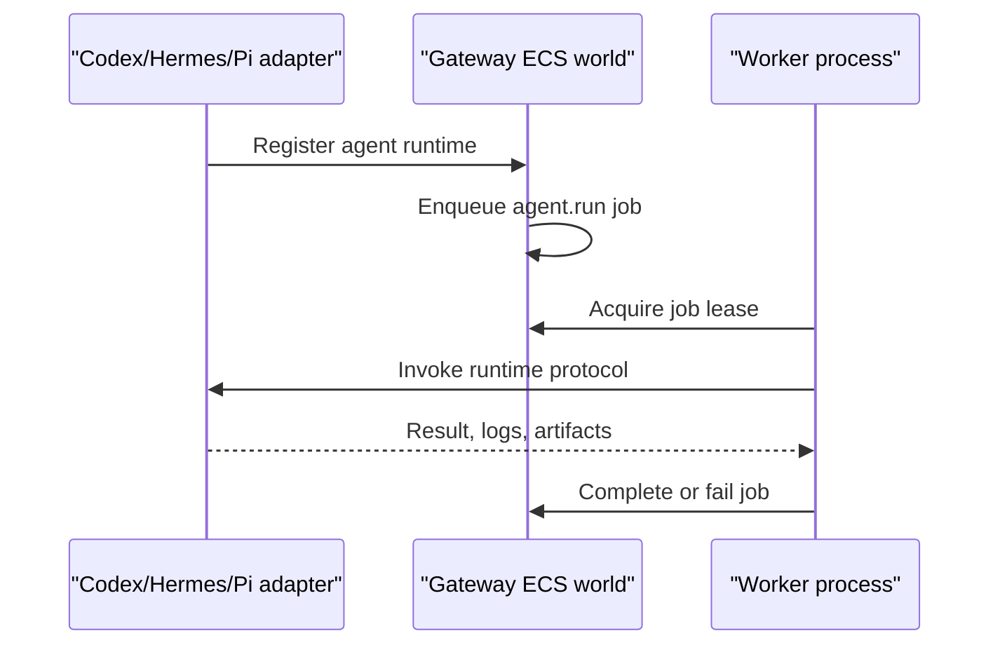

# Architecture

Snapdragon is split into a Rust-first orchestration runtime and host-side SDK
packages.

- `crates/core` contains the Rust/WASI component runtime primitives.
- `packages/core` exposes bundle and schedule types for JavaScript users.
- `packages/host` owns provider adapters and capability dispatch.
- `packages/session` owns portable append-only JSONL sessions.
- `packages/config` owns resolved config contracts and normalization helpers.
- `packages/tools` owns the tool registry plus coding and REPL tools.
- `packages/agent` composes providers and tools into an embeddable loop.
- `packages/gateway` exposes gateway client contracts, an inline harness, and
  Rust daemon IPC bindings.
- `packages/learn` defines learning, evaluation, rollout, rubric, and training
  job contracts.
- `packages/repl` ships the default command-line agent.

The first public release keeps the default experience small: chat, coding tools, and a REPL tool that can inspect and call the registered tool surface programmatically.

## Two-Layer ECS Model

Snapdragon uses ECS at two different scales.

The single-agent ECS loop lives inside embedded workers. There is usually one
agent entity, with components for prompt state, memory, context, provider
configuration, tool registry, session state, and run events. Systems mutate
those components through a small reducer, so adding memory systems, provider
calls, or tool execution does not require a bespoke loop.

The gateway ECS world is the multi-entity orchestration layer. Agents, workers,
services, jobs, channels, sessions, capabilities, sandboxes, approvals, and
projects are modeled as runtime entities. Systems such as schedulers,
supervisors, policy evaluators, dispatchers, log projectors, and executive
agents act when matching entities are ready.

## Gateway Runtime

The gateway is the runtime substrate for work that should not be tied to the
interactive `sd` TUI. It is Rust-first, with TypeScript contracts layered on
top:

- `crates/gateway-core` contains actor ids, envelopes, mailboxes, selective
  receive filters, registry state, service specs, links, monitors, supervision
  types, agent runtime descriptors, transport traits, and ETS-like table
  primitives.
- `crates/gateway-daemon` runs the Tokio daemon, local IPC server, SQLite WAL
  store, service scheduler, worker process launcher, runtime registry, and
  status surface.
- `crates/gateway-wasm` is the Wasmtime budget boundary for future sandboxed
  kernels and extension work.
- `packages/gateway` is the JavaScript facade used by `sd`, extensions, tests,
  and future embedders.

`sd` registers gateway services from resolved config. In Rust mode those
services run through headless worker commands that rebuild only the background
runtime pieces they need, instead of loading Ink or the full interactive CLI.
This keeps command-only paths such as help, status, and service runs from
accidentally paying the TUI/runtime cost.

The local gateway now has durable jobs, events, worker records and heartbeats,
leases, logs, service snapshots, agent runtime descriptors, world snapshots, and
headless agent jobs. `sd`
consumes those contracts for memory, skill, session-index, channel-event, learn,
and agent-job services. Service supervision now covers restart policy, restart
intensity, backoff, stale lease expiry, queue depth reporting, active lease
visibility, registered worker status, recent failure logs, worker process
snapshots, and timeout-triggered child kills. The built-in sandbox backend is
local git worktrees with
reference-root links; Iroh clustering, appliance resource routing, richer
sandbox backends, and learn/RL process management are next layers on the same
contracts, not responsibilities of the interactive TUI.

## TypeScript Facade and REST/SSE

`@snapdragon-ai/gateway` is the npm-installable facade. It keeps the JS-facing
surface ergonomic while Rust remains the durable source of truth.

- Inline mode is an in-memory harness for tests and lightweight embedders.
- Rust mode speaks JSONL IPC to the daemon over a local Unix socket.
- World snapshots gather services, agent runtimes, durable worker records,
  worker process diagnostics, jobs, events, logs, registry entries, leases, queue
  depths, tables, and sandbox leases.
- The REST/SSE facade wraps any `GatewayClient` without replacing local IPC.

REST is the integration surface for external apps, dashboards, and future auth.
The first routes are local-only and cover health, status, world snapshots,
services, agents, workers, jobs, events, logs, registry, capabilities, and
sandbox listing. `workers` are durable registered worker entities; daemon-spawned
process diagnostics live under `worker-processes`. Auth and policy enforcement
are explicit extension points, not silent assumptions. Operators can expose this
local surface with `sd gateway rest serve`, which binds loopback by default for
UI and adapter previews.

## External Agents and Executive Agents

External agents register as agent runtimes. A runtime descriptor declares its
id, kind, protocol, command or RPC shape, supported job kinds, capabilities,
isolation preference, health, and metadata. The gateway dispatches work by job
kind and routing hints instead of hardcoding integrations for individual
agents.

Executive agents are ordinary orchestrator participants. They observe goals,
world snapshots, logs, and child job state; then they enqueue child jobs, revise
plans, update artifacts, cancel stuck work, or request escalation. This keeps
organizational hierarchy inspectable and revocable rather than hiding it in a
special nested control path.
