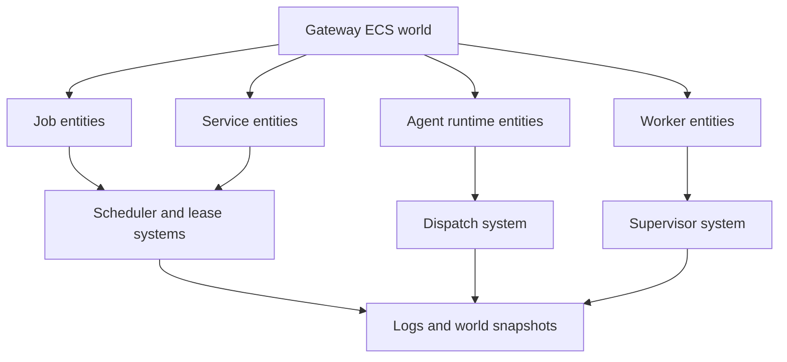
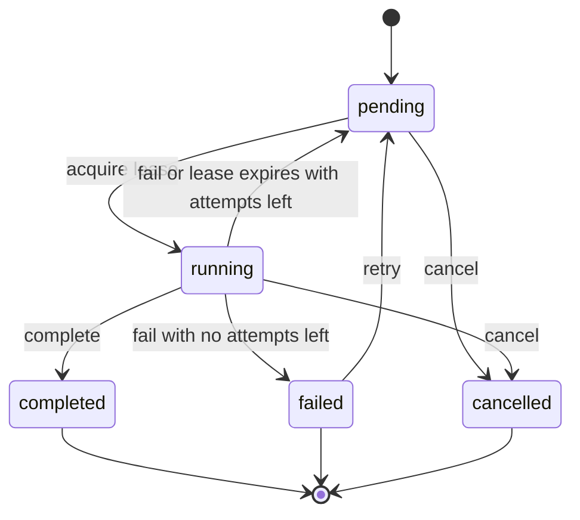
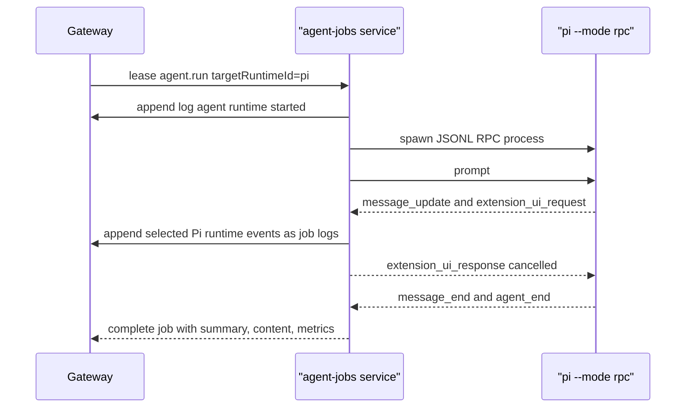
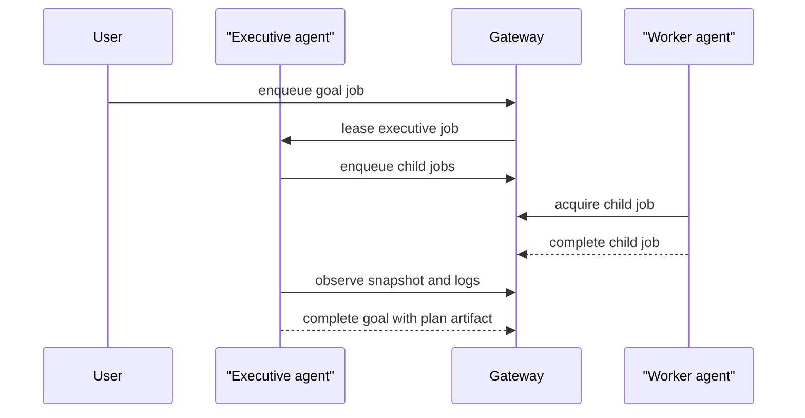

# Gateway Orchestration

Snapdragon has two ECS layers. The embedded agent loop keeps one run small and
composable. The gateway ECS world drives many entities asynchronously: agents,
workers, services, jobs, channels, sessions, capabilities, sandboxes, approvals,
and projects.

## Entities, Components, and Systems

The gateway should expose concrete nouns to users and agents while preserving an
ECS-shaped implementation internally.

| Gateway noun | ECS role | Common components |
| --- | --- | --- |
| Agent runtime | Entity | kind, protocol, command/RPC endpoint, supported jobs, capabilities, health |
| Worker | Entity | logical state, lease, runtime id, heartbeat, current job, capabilities |
| Job | Entity | spec, state, queue, priority, attempts, parentage, routing hints |
| Service | Entity | schedule, enabled state, restart policy, budget, worker command |
| Channel | Entity | target, event queue, subscribers, session refs |
| Sandbox | Entity | backend, cwd, project ref, lease expiry, reference roots |
| Capability | Component | provider actors, scopes, policy hints |
| Project | Entity | root, branch, config, policy defaults |

Systems act when entities match their conditions:

- Scheduler systems enqueue due service runs and event work.
- Lease systems acquire pending jobs, expire stale leases, and release failed
  workers.
- Dispatch systems route jobs to matching agent runtimes or native services.
- Supervisor systems restart transient workers and suppress restart storms.
- Policy systems evaluate scopes, approvals, sandbox requirements, and future
  auth decisions.
- Log and projection systems build inspectable snapshots for CLI, REST, SSE,
  and UI.
- Executive-agent systems decompose goals, enqueue child jobs, watch status, and
  update plan artifacts.

## Job and Event Lifecycle

Durable jobs are the canonical unit of work. Events remain useful as signals and
audit records, but actionable event work should eventually become leaseable jobs
or use equivalent acquire/complete/fail semantics.

Every job should have enough context for agent experience: kind, queue, payload,
priority, parent job id, correlation id, target runtime id, project/channel refs,
sandbox lease, policy hints, attempts, last error, result, and logs.

Acquiring a job also updates the worker registry. The gateway records the
worker id, queue, lease id, expiry, and current job. Completing, failing,
cancelling, or expiring that lease returns the worker to `idle`, while explicit
heartbeats can mark it `offline` or attach operator-facing status and metadata.
This gives executive agents and dashboards a direct capacity surface instead of
forcing them to infer availability from subprocess listings.

Failure with attempts remaining requeues the job as `pending`. Once attempts are
exhausted, the job becomes `failed` until an operator or executive agent retries
it explicitly. Cancellation remains terminal.

## Agent Runtime Registration

Agent runtimes are registered descriptors, not hardcoded integrations. The first
descriptor fields are:

- `id`, `kind`, and `protocol`.
- optional command spec or future RPC endpoint metadata.
- supported job kinds and declared capabilities.
- isolation preference such as inherit, profile, channel, or sandbox.
- health and metadata for dashboards and routing.

`sd` should register as the built-in runtime. Pi Agent is the first concrete
external adapter: Snapdragon registers a `kind: "pi"`, `protocol: "jsonl"`
descriptor and launches `pi --mode rpc` as a worker runtime. Codex, Hermes
Agent, and custom workers should use the same descriptor model through command,
JSONL, stdio, HTTP, or embedded protocols.

The Rust gateway persists registered runtime descriptors in its durable store.
The `sd` facade can also save descriptors under `gateway.agent_runtimes`; saved
descriptors are visible in `sd gateway agents list/show` even before the daemon
is available, and job workers can re-register them before dispatch. This gives
operators one stable setup step instead of a hidden in-memory runtime table.
Agent job services should also register logical worker records and heartbeat
while waiting, running, or shutting down, regardless of whether their runtime is
embedded, command-based, JSONL, stdio, or HTTP.

While a runtime job is active, the worker polls the durable job record. If an
operator or executive agent cancels the job through IPC, REST, or CLI, the
worker aborts the runtime signal and the Pi adapter sends an RPC `abort` before
stopping the child process. Cancelled jobs are terminal: late completion or
failure writes from a worker return the cancelled record instead of resurrecting
the job.

## Executive Agents

Executive agents are ordinary orchestrator participants. They read a goal and
world snapshot, write a plan, enqueue child jobs, observe logs and status, then
revise or cancel work. This keeps organizational hierarchy visible and
revocable.

## Supervision and Failure Modes

Failures should be explicit and inspectable:

- A crashed worker records process state, last error, and recent logs.
- A timed-out worker is killed by the daemon and recorded as `timed_out`.
- A stale lease expires during watchdog/status passes and clears the logical
  worker lease.
- Retry decisions are controlled by job attempts and service restart intensity.
- Cancellation updates the durable record, removes active leases, aborts
  cooperative runtime workers, and stops future dispatch.
- Policy or approval blocks should be represented as state, not hidden logs.

## AX Expectations

The gateway is for agents as much as humans. A good control surface should make
the next action obvious:

- One path to enqueue, inspect, cancel, and retry jobs.
- Stable ids and correlation ids across jobs, events, logs, and artifacts.
- World snapshots that explain queue depth, active leases, workers, runtimes,
  and recent failures.
- Separate `workers` from `workerProcesses`: workers answer who can take work;
  worker processes answer what the daemon spawned and how it exited.
- Concrete public nouns: jobs, services, agents, workers, capabilities, events,
  logs, sandboxes.
- ECS terminology stays in architecture docs and implementation internals unless
  the caller is building gateway systems directly.
