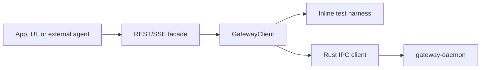

# Gateway REST API

The REST/SSE facade wraps a `GatewayClient`. It is an integration surface for
dashboards, Pi/Hermes adapters, local tools, and future auth. It does not
replace Rust IPC; Rust remains the durable runtime and the REST server sits on
top of the TypeScript facade.



## Server

```ts
import { createGatewayRestServer, RustGatewayClient } from '@snapdragon-ai/gateway';

const gateway = new RustGatewayClient({ socketPath: '/tmp/snapdragon-gateway.sock' });
const rest = createGatewayRestServer(gateway);
const baseUrl = await rest.listen();
```

By default the server binds to `127.0.0.1` and uses `/v1` as its path prefix.
Remote exposure, authentication, and policy enforcement are future layers and
should be added above the same route shape.

`sd` can serve the same facade for operators, UI previews, and external local
adapters:

```sh
sd gateway rest serve --start --port 8787
```

The command binds `127.0.0.1:8787` by default, announces the full base URL, and
keeps running until interrupted. It refuses non-loopback hosts unless
`--allow-remote` is explicit, because this first surface is local-only and does
not yet install auth middleware.

## Routes

| Method | Path | Purpose |
| --- | --- | --- |
| `GET` | `/v1/health` | Runtime liveness and runtime kind. |
| `GET` | `/v1/status` | Low-cost daemon/operator status. |
| `GET` | `/v1/world` | Full world snapshot for UI and agent inspection. |
| `GET` | `/v1/stream` | Server-Sent Events stream of typed gateway snapshot and heartbeat events. |
| `GET` | `/v1/services` | List service statuses. |
| `POST` | `/v1/services` | Register a service spec. |
| `POST` | `/v1/services/:name/run` | Run a service immediately. |
| `POST` | `/v1/services/:name/enable` | Enable or disable a service. |
| `GET` | `/v1/agents` | List registered agent runtimes. |
| `POST` | `/v1/agents/register` | Register and durably store an agent runtime descriptor. |
| `GET` | `/v1/agents/:id` | Show one runtime descriptor. |
| `DELETE` | `/v1/agents/:id` | Unregister one runtime descriptor. |
| `POST` | `/v1/agents/:id/unregister` | Unregister one runtime descriptor for clients that avoid `DELETE`. |
| `GET` | `/v1/workers` | List durable registered workers. |
| `POST` | `/v1/workers` | Register or update a durable worker record. |
| `GET` | `/v1/workers/:id` | Show one durable worker record. |
| `POST` | `/v1/workers/:id/heartbeat` | Update worker state, queue, status, and heartbeat time. |
| `DELETE` | `/v1/workers/:id` | Unregister one durable worker record. |
| `POST` | `/v1/workers/:id/unregister` | Unregister one durable worker record for clients that avoid `DELETE`. |
| `GET` | `/v1/worker-processes` | List diagnostic service worker process snapshots. |
| `GET` | `/v1/jobs` | List durable jobs. |
| `POST` | `/v1/jobs` | Enqueue a durable job. |
| `GET` | `/v1/jobs/:id` | Show one job. |
| `DELETE` | `/v1/jobs/:id` | Cancel one job. |
| `POST` | `/v1/jobs/:id/cancel` | Cancel one job. |
| `POST` | `/v1/jobs/:id/retry` | Requeue a failed job. |
| `GET` | `/v1/events` | List gateway events. |
| `POST` | `/v1/events` | Append an event. |
| `GET` | `/v1/events/:id` | Show one event. |
| `DELETE` | `/v1/events/:id` | Cancel one event. |
| `POST` | `/v1/events/:id/cancel` | Cancel one event. |
| `GET` | `/v1/logs` | Tail logs, with optional `target` and `limit`. |
| `POST` | `/v1/logs` | Append an inspectable runtime breadcrumb. |
| `GET` | `/v1/registry` | Registry names, capabilities, and channels. |
| `GET` | `/v1/capabilities` | Capability provider map. |
| `GET` | `/v1/sandboxes` | List active sandbox leases. |
| `POST` | `/v1/sandboxes` | Create or record a sandbox lease. |
| `GET` | `/v1/sandboxes/:id` | Show one active sandbox lease. |
| `POST` | `/v1/sandboxes/:id/release` | Release one sandbox lease. |

Runtime workers append job-targeted logs over local IPC while they run. External
adapters can use `POST /v1/logs` when REST is their integration surface, and
operators inspect those breadcrumbs with `GET /v1/logs?target=<job_id>`. For Pi
runtime jobs this includes lifecycle events such as `agent_start`,
`message_end`, tool execution boundaries, extension UI requests, and
cancellation observation without exposing raw token deltas by default.

Runtime registration validates descriptors before storage. Runtime ids must be
URL/config-safe, command-like protocols require a non-empty `command.command`,
and blank supported job kinds or capabilities are rejected with `400` responses.
`DELETE /v1/agents/:id` removes a stale or retired runtime from the live gateway
and durable store; userland config entries remain separate so `sd --config`
files are never mutated by the REST facade.

Worker registration is separate from process snapshots. `workers` are durable
gateway entities that external adapters and headless job runners can register,
heartbeat, and inspect. `worker-processes` are low-level diagnostics for service
commands spawned by the daemon. `DELETE /v1/workers/:id` removes stale or
retired worker identities without deleting job, log, or process history.

## Request Examples

Register an external runtime:

```http
POST /v1/agents/register
content-type: application/json

{
  "descriptor": {
    "id": "codex",
    "kind": "codex",
    "protocol": "command",
    "command": {
      "command": "codex",
      "args": ["--json"]
    },
    "supportedJobKinds": ["agent.run"],
    "capabilities": ["repo.edit", "tools.shell"],
    "isolation": "sandbox"
  }
}
```

Register the local Pi runtime:

```http
POST /v1/agents/register
content-type: application/json

{
  "descriptor": {
    "id": "pi",
    "kind": "pi",
    "protocol": "jsonl",
    "label": "Pi Agent",
    "command": {
      "command": "pi",
      "args": ["--mode", "rpc"]
    },
    "supportedJobKinds": ["agent.run"],
    "capabilities": ["llm.chat", "tools.pi", "skills.pi", "extensions.pi"],
    "isolation": "profile"
  }
}
```

Register and heartbeat a worker:

```http
POST /v1/workers
content-type: application/json

{
  "worker": {
    "id": "pi-worker-1",
    "queue": "default",
    "runtimeId": "pi",
    "capabilities": ["agent.run", "tools.pi"],
    "status": "ready"
  }
}
```

```http
POST /v1/workers/pi-worker-1/heartbeat
content-type: application/json

{
  "state": "idle",
  "status": "waiting for work"
}
```

When a worker acquires a job lease, the gateway records its `currentJobId`,
`currentLeaseId`, and lease expiry. Completion, failure, cancellation, and lease
expiry clear that active lease back to an idle worker record. Workers that have
not explicitly registered are auto-created on acquire so ad-hoc adapters are
still inspectable.

Enqueue a routed agent job:

```http
POST /v1/jobs
content-type: application/json

{
  "spec": {
    "kind": "agent.run",
    "queue": "default",
    "priority": 10,
    "payload": {
      "prompt": "Run the release checks and summarize failures.",
      "targetRuntimeId": "pi",
      "correlationId": "release-check-001",
      "policyHints": {
        "approvalRequired": false,
        "scopes": ["repo.read", "tests.run"]
      }
    }
  }
}
```

Cancel a running job:

```http
POST /v1/jobs/job_123/cancel
content-type: application/json

{}
```

The durable gateway treats cancellation as terminal. Cooperative workers observe
the cancelled job record, abort their runtime signal, clear active leases, and
leave subsequent late `complete` or `fail` writes as no-ops against the
cancelled status.

Retry a failed job:

```http
POST /v1/jobs/job_123/retry
content-type: application/json

{}
```

Explicit worker failures and expired leases both requeue a job while it still
has attempts remaining. Once attempts are exhausted, the job becomes `failed`
and can be manually requeued with `POST /v1/jobs/:id/retry`. Manual retry keeps
the attempt count and last error visible for inspection, clears the active
lease/result, and returns the job in `pending` state. Completed, pending,
running, and cancelled jobs are not resurrected by retry.

Append and inspect a runtime breadcrumb:

```http
POST /v1/logs
content-type: application/json

{
  "target": "job_123",
  "level": "info",
  "message": "agent runtime event: agent_start",
  "data": { "runtime": "pi" }
}
```

Then tail logs for the same job:

```http
GET /v1/logs?target=job_123&limit=20
```

Create and release a sandbox lease:

```http
POST /v1/sandboxes
content-type: application/json

{
  "spec": {
    "sandboxId": "release-check-worktree",
    "cwd": "/tmp/snapdragon/sandboxes/worktrees/release-check-worktree",
    "backend": "worktree",
    "project": {
      "id": "snapdragon",
      "root": "/Users/shannon/Workspace/snapdragon",
      "branch": "main"
    },
    "referenceRoots": ["/Users/shannon/Workspace/reference-repo"],
    "ttlMs": 3600000
  }
}
```

The response is a `GatewaySandboxLease`. The same lease then appears in
`GET /v1/sandboxes` and the `sandboxes` field of `GET /v1/world` until it is
released or expires.

```http
POST /v1/sandboxes/lease_release-check-worktree/release
content-type: application/json

{}
```

Watch world snapshots:

```http
GET /v1/stream?intervalMs=1000&heartbeatMs=15000
accept: text/event-stream
```

Each SSE frame includes `id`, `event`, `retry`, and a JSON envelope in `data`.
Snapshot frames use `event: snapshot` and carry
`{ "type": "snapshot", "id": 1, "atMs": 0, "snapshot": GatewayWorldSnapshot }`.
Heartbeat frames use `event: heartbeat` with the runtime kind so clients can
distinguish a quiet world from a dead connection. Errors are emitted as
`event: error` with `{ "type": "error", "id": 2, "atMs": 0, "error": "..." }`.
Clients can override the snapshot and heartbeat cadence per connection with
`intervalMs` and `heartbeatMs` query params.

## Response Shapes

`GatewayWorldSnapshot` is the primary dashboard and agent inspection shape. It
contains captured time, runtime kind, raw status, service statuses, agent runtime
descriptors, durable worker records, worker process diagnostics, durable jobs,
events, logs, registry, leases, queue depths, table snapshots, and sandbox
leases.

The API intentionally returns the same camelCase TypeScript shapes exposed by
`@snapdragon-ai/gateway`. Rust IPC wire casing stays behind the facade.

Missing resource mutation responses are explicit. Cancelling or retrying an
unknown job returns `404 { "error": "job not found" }`; cancelling an unknown
event returns `404 { "error": "event not found" }`. This keeps operator UIs and
agent scripts from mistaking a no-op for successful cancellation.
