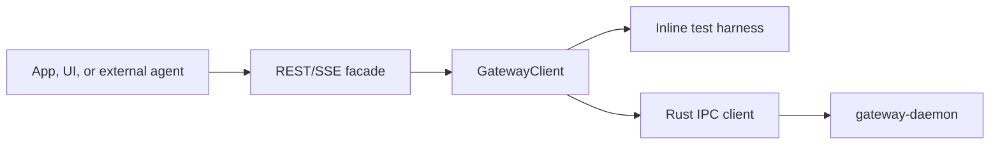

# Gateway REST API

The REST/SSE facade wraps a `GatewayClient`. It is an integration surface for
dashboards, Pi/Hermes adapters, local tools, and future auth. It does not
replace Rust IPC; Rust remains the durable runtime and the REST server sits on
top of the TypeScript facade.



## Server

```ts
import { createGatewayRestServer, RustGatewayClient } from '@snapdragon-ai/gateway';

const gateway = new RustGatewayClient({ socketPath: '/tmp/snapdragon-gateway.sock' });
const rest = createGatewayRestServer(gateway);
const baseUrl = await rest.listen();
```

By default the server binds to `127.0.0.1` and uses `/v1` as its path prefix.
Remote exposure, authentication, and policy enforcement are future layers and
should be added above the same route shape.

For the packaged `sd` operator flow, start the Rust daemon and then run the
foreground REST/SSE bridge:

```sh
sd gateway start
sd gateway rest serve --port 8787
```

The command prints the base URL, defaults to `http://127.0.0.1:8787/v1`, and
accepts `--ready-file <path>` so UI launchers can wait for the exact bound URL.
Use `--port 0` for an ephemeral test port.

## Routes

| Method | Path | Purpose |
| --- | --- | --- |
| `GET` | `/v1/health` | Runtime liveness and runtime kind. |
| `GET` | `/v1/status` | Low-cost daemon/operator status. |
| `GET` | `/v1/world` | Full world snapshot for UI and agent inspection. |
| `GET` | `/v1/stream` | Server-Sent Events stream of world snapshots. |
| `GET` | `/v1/services` | List service statuses. |
| `POST` | `/v1/services` | Register a service spec. |
| `POST` | `/v1/services/:name/run` | Run a service immediately. |
| `POST` | `/v1/services/:name/enable` | Enable or disable a service. |
| `GET` | `/v1/agents` | List registered agent runtimes. |
| `POST` | `/v1/agents/register` | Register and durably store an agent runtime descriptor. |
| `GET` | `/v1/agents/:id` | Show one runtime descriptor. |
| `GET` | `/v1/workers` | List logical job workers and external agent adapters. |
| `GET` | `/v1/workers/:id` | Show one logical worker record. |
| `POST` | `/v1/workers/register` | Register or update a logical worker record. |
| `POST` | `/v1/workers/:id/heartbeat` | Update worker state, queue, status, error, or metadata. |
| `GET` | `/v1/jobs` | List durable jobs. |
| `POST` | `/v1/jobs` | Enqueue a durable job. |
| `GET` | `/v1/jobs/:id` | Show one job. |
| `POST` | `/v1/jobs/:id/cancel` | Cancel one job. |
| `POST` | `/v1/jobs/:id/retry` | Requeue a failed job for another worker attempt. |
| `GET` | `/v1/events` | List gateway events. |
| `POST` | `/v1/events` | Append an event. |
| `POST` | `/v1/events/:id/cancel` | Cancel one event. |
| `GET` | `/v1/logs` | Tail logs, with optional `target` and `limit`. |
| `GET` | `/v1/registry` | Registry names, capabilities, and channels. |
| `GET` | `/v1/capabilities` | Capability provider map. |
| `GET` | `/v1/sandboxes` | List active sandbox leases. |
| `POST` | `/v1/sandboxes/register` | Register or update a sandbox lease. |
| `GET` | `/v1/sandboxes/:id` | Show one sandbox lease. |
| `POST` | `/v1/sandboxes/:id/release` | Release one sandbox lease. |

Runtime workers append job-targeted logs over local IPC while they run. REST
clients inspect those breadcrumbs with `GET /v1/logs?target=<job_id>`. For Pi
runtime jobs this includes lifecycle events such as `agent_start`,
`message_end`, tool execution boundaries, extension UI requests, and
cancellation observation without exposing raw token deltas by default.

## Request Examples

Register an external runtime:

```http
POST /v1/agents/register
content-type: application/json

{
  "descriptor": {
    "id": "codex",
    "kind": "codex",
    "protocol": "command",
    "supportedJobKinds": ["agent.run"],
    "capabilities": ["repo.edit", "tools.shell"],
    "isolation": "sandbox"
  }
}
```

Register the local Pi runtime:

```http
POST /v1/agents/register
content-type: application/json

{
  "descriptor": {
    "id": "pi",
    "kind": "pi",
    "protocol": "jsonl",
    "label": "Pi Agent",
    "command": {
      "command": "pi",
      "args": ["--mode", "rpc"]
    },
    "supportedJobKinds": ["agent.run"],
    "capabilities": ["llm.chat", "tools.pi", "skills.pi", "extensions.pi"],
    "isolation": "profile"
  }
}
```

Enqueue a routed agent job:

```http
POST /v1/jobs
content-type: application/json

{
  "spec": {
    "kind": "agent.run",
    "queue": "default",
    "priority": 10,
    "payload": {
      "prompt": "Run the release checks and summarize failures.",
      "targetRuntimeId": "pi",
      "correlationId": "release-check-001",
      "policyHints": {
        "approvalRequired": false,
        "scopes": ["repo.read", "tests.run"]
      }
    }
  }
}
```

Register a logical worker before claiming work:

```http
POST /v1/workers/register
content-type: application/json

{
  "worker": {
    "id": "pi-agent-jobs-1",
    "queue": "default",
    "runtimeId": "pi",
    "service": "agent-jobs",
    "capabilities": ["agent.run", "skills.pi"],
    "status": "waiting"
  }
}
```

Heartbeat worker availability or failure:

```http
POST /v1/workers/pi-agent-jobs-1/heartbeat
content-type: application/json

{
  "state": "idle",
  "status": "waiting",
  "metadata": {
    "lastRuntimeProbe": "ok"
  }
}
```

Cancel a running job:

```http
POST /v1/jobs/job_123/cancel
content-type: application/json

{}
```

The durable gateway treats cancellation as terminal. Cooperative workers observe
the cancelled job record, abort their runtime signal, clear active leases, and
leave subsequent late `complete` or `fail` writes as no-ops against the
cancelled status.

Retry a failed job:

```http
POST /v1/jobs/job_123/retry
content-type: application/json

{}
```

Failed jobs with remaining attempts automatically return to `pending` when a
worker reports failure. `retry` is the manual operator/executive-agent path for
terminal failed jobs; jobs in other states are returned unchanged, and cancelled
jobs stay cancelled.

Register a sandbox lease:

```http
POST /v1/sandboxes/register
content-type: application/json

{
  "lease": {
    "id": "lease_project-a",
    "sandboxId": "project-a-worktree",
    "cwd": "/Users/shannon/.snapdragon/sandboxes/worktrees/project-a",
    "acquiredAtMs": 1780876800000,
    "expiresAtMs": 1780880400000,
    "backend": "worktree",
    "project": {
      "id": "project-a",
      "root": "/Users/shannon/Workspace/project-a",
      "branch": "main"
    },
    "referenceRoots": ["/Users/shannon/Workspace/reference"]
  }
}
```

Sandbox leases are gateway-visible ownership records. Releasing a lease removes
the durable record; backend-specific cleanup such as removing a git worktree is
performed by the owning worker or CLI command.

Watch world snapshots:

```http
GET /v1/stream
accept: text/event-stream
```

Each SSE message uses `event: snapshot` and a JSON `GatewayWorldSnapshot` body.
Errors are emitted as `event: error` with a small JSON error object.

## Response Shapes

`GatewayWorldSnapshot` is the primary dashboard and agent inspection shape. It
contains captured time, runtime kind, raw status, service statuses, agent runtime
descriptors, logical workers, worker process snapshots, durable jobs, events,
logs, registry, leases, queue depths, table snapshots, and sandbox leases.

`workers` are durable logical participants that can register, heartbeat, and
hold job leases. `workerProcesses` are OS subprocess snapshots produced by the
Rust service supervisor. Keeping both shapes visible lets UIs show available
agent capacity separately from low-level process health.

The API intentionally returns the same camelCase TypeScript shapes exposed by
`@snapdragon-ai/gateway`. Rust IPC wire casing stays behind the facade.
