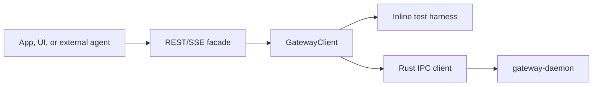

# Gateway REST API

The REST/SSE facade wraps a `GatewayClient`. It is an integration surface for
dashboards, Pi/Hermes adapters, local tools, and future auth. It does not
replace Rust IPC; Rust remains the durable runtime and the REST server sits on
top of the TypeScript facade.



## Server

```ts
import { createGatewayRestServer, RustGatewayClient } from '@snapdragon-ai/gateway';

const gateway = new RustGatewayClient({ socketPath: '/tmp/snapdragon-gateway.sock' });
const rest = createGatewayRestServer(gateway);
const baseUrl = await rest.listen();
```

By default the server binds to `127.0.0.1` and uses `/v1` as its path prefix.
Remote exposure, authentication, and policy enforcement are future layers and
should be added above the same route shape. The prefix is matched as a complete
path segment, so `/v10/...` is not treated as a `/v1` route.

## Routes

| Method | Path | Purpose |
| --- | --- | --- |
| `GET` | `/v1/health` | Runtime liveness and runtime kind. |
| `GET` | `/v1/status` | Low-cost daemon/operator status. |
| `GET` | `/v1/world` | Full world snapshot for UI and agent inspection. |
| `GET` | `/v1/stream` | Server-Sent Events stream of world snapshots. |
| `GET` | `/v1/services` | List service statuses. |
| `POST` | `/v1/services` | Register a service spec. |
| `POST` | `/v1/services/:name/run` | Run a service immediately. |
| `POST` | `/v1/services/:name/enable` | Enable or disable a service. |
| `GET` | `/v1/agents` | List registered agent runtimes. |
| `POST` | `/v1/agents/register` | Register and durably store an agent runtime descriptor. |
| `GET` | `/v1/agents/:id` | Show one runtime descriptor. |
| `GET` | `/v1/workers` | List worker process snapshots. |
| `GET` | `/v1/jobs` | List durable jobs. |
| `POST` | `/v1/jobs` | Enqueue a durable job. |
| `GET` | `/v1/jobs/:id` | Show one job. |
| `POST` | `/v1/jobs/:id/cancel` | Cancel one job. |
| `GET` | `/v1/events` | List gateway events. |
| `POST` | `/v1/events` | Append an event. |
| `POST` | `/v1/events/:id/cancel` | Cancel one event. |
| `GET` | `/v1/logs` | Tail logs, with optional `target` and `limit`. |
| `GET` | `/v1/registry` | Registry names, capabilities, and channels. |
| `GET` | `/v1/capabilities` | Capability provider map. |
| `GET` | `/v1/sandboxes` | Sandbox lease list placeholder. |

Runtime workers append job-targeted logs over local IPC while they run. REST
clients inspect those breadcrumbs with `GET /v1/logs?target=<job_id>`. For Pi
runtime jobs this includes lifecycle events such as `agent_start`,
`message_end`, tool execution boundaries, extension UI requests, and
cancellation observation without exposing raw token deltas by default.

## Request Examples

Register an external runtime:

```http
POST /v1/agents/register
content-type: application/json

{
  "descriptor": {
    "id": "codex",
    "kind": "codex",
    "protocol": "command",
    "supportedJobKinds": ["agent.run"],
    "capabilities": ["repo.edit", "tools.shell"],
    "isolation": "sandbox"
  }
}
```

Register the local Pi runtime:

```http
POST /v1/agents/register
content-type: application/json

{
  "descriptor": {
    "id": "pi",
    "kind": "pi",
    "protocol": "jsonl",
    "label": "Pi Agent",
    "command": {
      "command": "pi",
      "args": ["--mode", "rpc"]
    },
    "supportedJobKinds": ["agent.run"],
    "capabilities": ["llm.chat", "tools.pi", "skills.pi", "extensions.pi"],
    "isolation": "profile"
  }
}
```

Enqueue a routed agent job:

```http
POST /v1/jobs
content-type: application/json

{
  "spec": {
    "kind": "agent.run",
    "queue": "default",
    "priority": 10,
    "payload": {
      "prompt": "Run the release checks and summarize failures.",
      "targetRuntimeId": "pi",
      "correlationId": "release-check-001",
      "policyHints": {
        "approvalRequired": false,
        "scopes": ["repo.read", "tests.run"]
      }
    }
  }
}
```

Cancel a running job:

```http
POST /v1/jobs/job_123/cancel
content-type: application/json

{}
```

The durable gateway treats cancellation as terminal. Cooperative workers observe
the cancelled job record, abort their runtime signal, clear active leases, and
leave subsequent late `complete` or `fail` writes as no-ops against the
cancelled status.

Watch world snapshots:

```http
GET /v1/stream
accept: text/event-stream
```

Each SSE message uses `event: snapshot` and a JSON `GatewayWorldSnapshot` body.
Errors are emitted as `event: error` with a small JSON error object.

## Response Shapes

`GatewayWorldSnapshot` is the primary dashboard and agent inspection shape. It
contains captured time, runtime kind, raw status, service statuses, agent runtime
descriptors, worker process snapshots, durable jobs, events, logs, registry,
leases, queue depths, table snapshots, and sandbox leases.

The API intentionally returns the same camelCase TypeScript shapes exposed by
`@snapdragon-ai/gateway`. Rust IPC wire casing stays behind the facade.

Error responses use a small JSON object:

```json
{ "error": "invalid JSON" }
```

Malformed JSON request bodies return `400`. Unknown routes return `404`.
